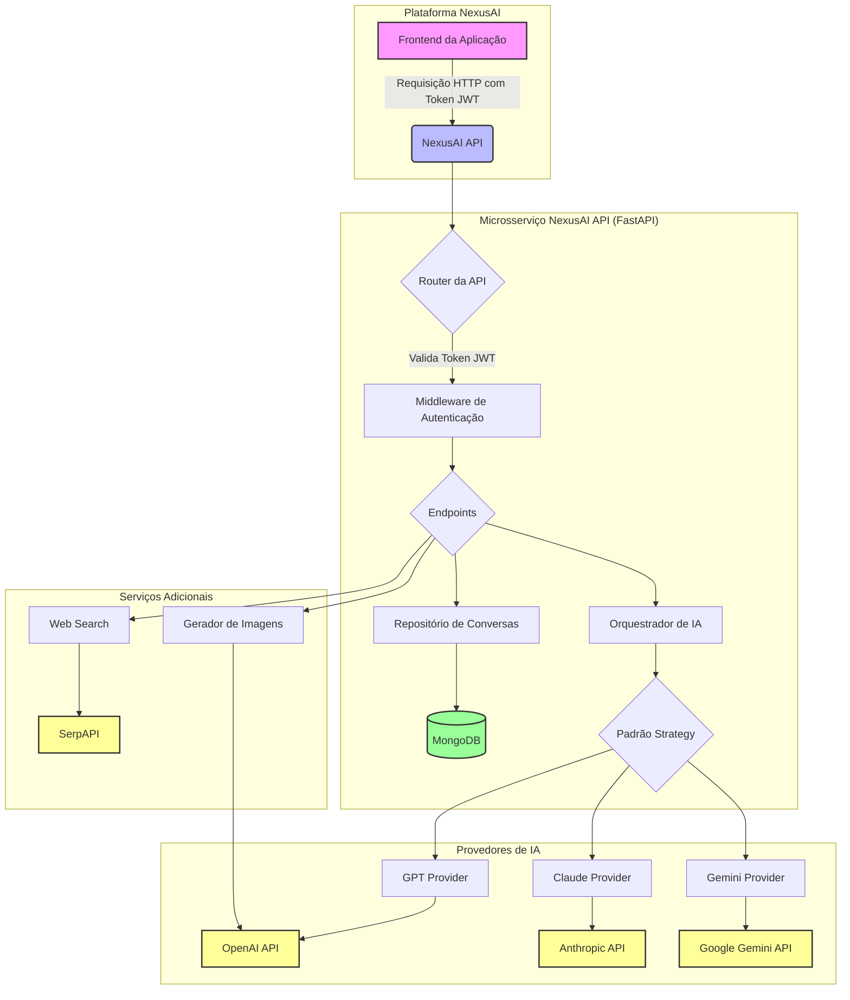

# 📚 Documentação Técnica da NexusAI API

**Versão:** 1.0  
**Data:** Outubro 2025  
**Autor:** Manus AI

---

## 📖 Sumário

1. [Visão Geral](#-visão-geral)
2. [Arquitetura do Sistema](#-arquitetura-do-sistema)
3. [Primeiros Passos](#-primeiros-passos)
4. [Autenticação](#-autenticação)
5. [Referência da API](#-referência-da-api)
6. [Sistema de Créditos e Preços](#-sistema-de-créditos-e-preços)
7. [Segurança](#-segurança)
8. [Estrutura do Projeto](#-estrutura-do-projeto)
9. [Deploy](#-deploy)

---


## 1. Visão Geral

A **NexusAI API** é um microsserviço de orquestração de Inteligência Artificial projetado para unificar o acesso a múltiplos provedores de IA em uma única interface. Ele permite que aplicações clientes (como o frontend da NexusAI) interajam com diversos modelos de linguagem e geração de imagens de forma padronizada, segura e escalável.

### 🎯 Objetivos

- **Unificação:** Prover uma API única para acessar modelos da OpenAI, Anthropic e Google.
- **Flexibilidade:** Permitir a escolha de diferentes modelos e modos de interação (low, medium, high).
- **Gerenciamento de Conversas:** Salvar, carregar e gerenciar o histórico de conversas dos usuários.
- **Segurança:** Proteger chaves de API e garantir que usuários acessem apenas seus próprios dados.
- **Escalabilidade:** Construído com tecnologias modernas e assíncronas (FastAPI, Motor) para alta performance.
- **Sistema de Créditos:** Fornecer informações detalhadas de uso e custo para cada requisição.

### ✨ Recursos Principais

- ✅ **Chat Completions:** Acesso a 8 modelos de linguagem de 3 provedores diferentes.
- ✅ **Gerenciamento de Conversas:** Armazenamento de histórico no MongoDB.
- ✅ **Autenticação JWT:** Todos os endpoints são protegidos.
- ✅ **Sistema de Créditos:** Cálculo de custo em tempo real para cada requisição.
- ✅ **Geração de Imagens:** Integração com DALL-E 3 da OpenAI.
- ✅ **Web Search:** Integração com Google Search via SerpAPI.
- ✅ **Documentação Automática:** Interface interativa do Swagger UI e Redoc.

### 🛠️ Tecnologias Utilizadas

| Categoria | Tecnologia | Justificativa |
|:---|:---|:---|
| **Framework Web** | FastAPI | Alta performance, assíncrono, documentação automática. |
| **Banco de Dados** | MongoDB | Flexibilidade (NoSQL), escalabilidade, ideal para documentos JSON. |
| **Driver do BD** | Motor | Driver oficial e assíncrono para MongoDB em Python. |
| **Validação de Dados** | Pydantic | Validação robusta de dados, schemas claros, integração nativa com FastAPI. |
| **Autenticação** | JWT (python-jose) | Padrão de mercado para APIs, seguro e stateless. |
| **Provedores de IA** | OpenAI, Anthropic, Google | Principais provedores de modelos de linguagem. |
| **Geração de Imagens**| DALL-E 3 | Modelo de alta qualidade da OpenAI. |
| **Web Search** | SerpAPI | API confiável para resultados do Google Search. |
| **Servidor ASGI** | Uvicorn | Servidor ASGI de alta performance para FastAPI. |

---


## 2. Arquitetura do Sistema

A arquitetura foi projetada para ser modular, escalável e segura, seguindo as melhores práticas de desenvolvimento de microsserviços.

###  diagrama de Arquitetura



### 🏛️ Componentes Principais

- **FastAPI App:** O ponto de entrada da aplicação, responsável por gerenciar o ciclo de vida, rotas e middlewares.
- **Middleware de Autenticação:** Intercepta todas as requisições, valida o token JWT e extrai as informações do usuário.
- **Endpoints da API:** Define todas as rotas disponíveis (chat, conversas, modelos, etc.) e lida com a lógica de requisição/resposta.
- **Orquestrador de IA:** O cérebro do sistema. Recebe a requisição do endpoint, seleciona o provedor de IA correto (usando o Padrão Strategy) e delega a geração da resposta.
- **Padrão Strategy:** Permite que o orquestrador trate todos os provedores de IA de forma uniforme através de uma interface comum (`BaseProvider`). Cada provedor (GPT, Claude, Gemini) é uma implementação concreta dessa interface.
- **Repositório de Conversas:** Abstrai a lógica de acesso ao banco de dados, fornecendo métodos para criar, ler, atualizar e deletar conversas e mensagens.
- **MongoDB (com Motor):** O banco de dados NoSQL usado para persistir todas as informações de usuários, conversas e mensagens.
- **Provedores Externos:** As APIs de terceiros (OpenAI, Anthropic, Google, SerpAPI) que fornecem os serviços de IA e busca.

### 🌊 Fluxo de uma Requisição de Chat

1. O **Frontend** envia uma requisição `POST /v1/chat/completions` com o prompt do usuário e um token JWT no cabeçalho.
2. O **Middleware de Autenticação** valida o token JWT.
3. O **Endpoint de Chat** recebe a requisição e a encaminha para o **Orquestrador de IA**.
4. O **Orquestrador** identifica o modelo solicitado (ex: "gpt-5-pro") e usa o **Padrão Strategy** para selecionar o `GptProvider`.
5. O `GptProvider` formata a requisição para o padrão da OpenAI e a envia para a **API da OpenAI**.
6. A API da OpenAI retorna a resposta.
7. O `GptProvider` padroniza a resposta (incluindo o cálculo de custo) e a retorna para o Orquestrador.
8. O **Orquestrador** salva a pergunta e a resposta no histórico da conversa usando o **Repositório de Conversas**, que persiste os dados no **MongoDB**.
9. O **Endpoint** retorna a resposta padronizada para o Frontend.

---


## 3. Primeiros Passos

Este guia irá ajudá-lo a configurar e executar a API localmente para desenvolvimento e testes.

### 📋 Pré-requisitos

- **Python 3.11+**
- **MongoDB** (local ou em um serviço como o MongoDB Atlas)
- **Chaves de API** dos provedores (OpenAI, Anthropic, Google)
- **SerpAPI Key** (opcional, para web search)

### ⚙️ Instalação

1. **Clone o repositório:**
   ```bash
   git clone <url-do-repositorio>
   cd nexusai_api
   ```

2. **Crie e ative um ambiente virtual:**
   ```bash
   # Criar ambiente
   python -m venv .venv

   # Ativar no Windows
   .venv\Scripts\activate

   # Ativar no Linux/macOS
   source .venv/bin/activate
   ```

3. **Instale as dependências:**
   ```bash
   pip install -r requirements.txt
   ```

### 🔑 Configuração das Variáveis de Ambiente

1. **Copie o arquivo de exemplo:**
   ```bash
   cp .env.example .env
   ```

2. **Edite o arquivo `.env`** e preencha com suas informações:
   ```env
   # Chave secreta para JWT (gere uma chave forte)
   JWT_SECRET_KEY=sua-chave-secreta-forte-aqui

   # URL de conexão do MongoDB
   MONGODB_URL=mongodb://localhost:27017

   # Chaves das APIs de IA
   OPENAI_API_KEY=sk-...
   ANTHROPIC_API_KEY=sk-ant-...
   GOOGLE_API_KEY=AIza...

   # Chave da SerpAPI (opcional)
   SERPAPI_API_KEY=...
   ```

   > **⚠️ Importante:** Nunca commite o arquivo `.env` no Git. Ele já está no `.gitignore` por padrão.

### ▶️ Executando a API

Com o ambiente virtual ativado, execute o seguinte comando:

```bash
# Inicia o servidor com hot-reload
uvicorn app.main:app --reload
```

A API estará disponível em `http://127.0.0.1:8000`.

### 📄 Acessando a Documentação Interativa

Após iniciar o servidor, você pode acessar a documentação automática (Swagger UI) para testar os endpoints interativamente:

- **Swagger UI:** [http://127.0.0.1:8000/docs](http://127.0.0.1:8000/docs)
- **Redoc:** [http://127.0.0.1:8000/redoc](http://127.0.0.1:8000/redoc)

  <!-- Placeholder para imagem do Swagger -->

---


## 4. Autenticação

Todos os endpoints da API são protegidos e requerem um **Token JWT** válido no cabeçalho `Authorization`.

### 🌊 Fluxo de Autenticação

1. O sistema principal da plataforma NexusAI é responsável por autenticar o usuário (com login e senha) e gerar um token JWT.
2. O frontend recebe este token e o armazena de forma segura.
3. Para cada requisição à NexusAI API, o frontend deve incluir o token no cabeçalho:
   ```
   Authorization: Bearer <seu_token_jwt>
   ```

### 🧪 Gerando um Token de Teste (Apenas Desenvolvimento)

Para facilitar os testes durante o desenvolvimento, a API inclui um endpoint para gerar tokens de teste. **Este endpoint DEVE ser removido em produção.**

**Endpoint:** `POST /v1/auth/token`

**Request Body:**
```json
{
  "user_id": "seu_id_de_usuario_para_teste"
}
```

**Exemplo com cURL:**
```bash
curl -X POST "http://127.0.0.1:8000/v1/auth/token" \
  -H "Content-Type: application/json" \
  -d '{"user_id": "user_123"}'
```

**Response:**
```json
{
  "access_token": "eyJhbGciOiJIUzI1NiIsInR5cCI6IkpXVCJ9...",
  "token_type": "bearer"
}
```

### 🚀 Usando o Token

Copie o `access_token` retornado e use-o para autenticar suas requisições aos outros endpoints.

**Exemplo com cURL:**
```bash
# Substitua <seu_token_jwt> pelo token gerado
curl -X GET "http://127.0.0.1:8000/v1/models" \
  -H "Authorization: Bearer <seu_token_jwt>"
```

---


## 5. Referência da API

A documentação completa e interativa de todos os endpoints está disponível no Swagger UI em `http://127.0.0.1:8000/docs`.

### Principais Endpoints

#### Chat Completions

- **`POST /v1/chat/completions`**: Envia um prompt para um modelo de IA e recebe uma resposta. Este é o endpoint principal para interações de chat.

#### Modelos

- **`GET /v1/models`**: Lista todos os modelos de IA disponíveis na plataforma, incluindo seus IDs, provedores e modos suportados.

#### Conversas

- **`POST /v1/conversations`**: Cria uma nova conversa vazia.
- **`GET /v1/conversations`**: Lista todas as conversas de um usuário.
- **`GET /v1/conversations/{id}`**: Obtém os detalhes e o histórico de mensagens de uma conversa específica.
- **`PUT /v1/conversations/{id}/title`**: Atualiza o título de uma conversa.
- **`POST /v1/conversations/{id}/favorite`**: Marca ou desmarca uma conversa como favorita.
- **`DELETE /v1/conversations/{id}`**: Deleta uma conversa e todo o seu histórico.

#### Geração de Imagens

- **`POST /v1/images/generate`**: Gera uma imagem com base em um prompt de texto usando DALL-E 3.

#### Web Search

- **`POST /v1/search`**: Realiza uma busca na web usando o Google Search.

#### Preços e Créditos

- **`GET /v1/pricing`**: Retorna a tabela de preços completa, com o custo em créditos para cada modelo.
- **`GET /v1/pricing/{model}`**: Retorna o preço de um modelo específico.
- **`GET /v1/images/pricing`**: Retorna o custo para geração de imagens.
- **`GET /v1/search/pricing`**: Retorna o custo para uma busca na web.

---


## 6. Sistema de Créditos e Preços

A plataforma opera com um sistema de créditos pré-pagos para o uso dos modelos de IA. Esta seção detalha como os custos são calculados e apresentados.

### 💰 Cálculo de Créditos

O custo de cada requisição é calculado com base nos seguintes fatores:

- **Modelo Utilizado:** Modelos mais avançados (como Claude Opus) custam mais caro.
- **Tokens de Entrada (Prompt):** O número de tokens no seu prompt.
- **Tokens de Saída (Resposta):** O número de tokens na resposta gerada pela IA.

> **Fórmula:** `Custo em Créditos = (Custo da API em USD * Margem de Lucro) * Taxa de Conversão`

- **Margem de Lucro:** 30%
- **Taxa de Conversão:** 1 USD = 100 créditos

### 📊 Tabela de Preços

A tabela de preços completa pode ser consultada via API no endpoint `GET /v1/pricing`.

**Custo em Créditos por 1.000 Tokens:**

| Modelo | Input (1K tokens) | Output (1K tokens) | Categoria |
|:---|---:|---:|:---|
| **OpenAI GPT** | | | |
| GPT-5 Pro | 0.16 | 1.30 | Premium |
| GPT-5 Mini | 0.08 | 0.31 | Econômico |
| **Anthropic Claude** | | | |
| Claude Opus 4.1 | 1.95 | 9.75 | Ultra Premium |
| Claude Sonnet 4.5 | 0.39 | 1.95 | Premium |
| Claude Haiku 4.5 | 0.13 | 0.65 | Balanceado |
| **Google Gemini** | | | |
| Gemini 2.5 Pro | 0.16 | 1.30 | Premium |
| Gemini 2.5 Flash | 0.04 | 0.16 | Econômico |

### 🖼️ Custos de Serviços Adicionais

- **Geração de Imagens (DALL-E 3):**
  - **Standard:** 5 créditos por imagem
  - **HD:** 10 créditos por imagem
- **Web Search (Google):** 1 crédito por busca

### 📈 Informações de Uso na Resposta

Cada resposta do endpoint `POST /v1/chat/completions` e dos serviços adicionais inclui um objeto `usage` com detalhes sobre o custo daquela requisição específica.

**Exemplo de Objeto `usage`:**
```json
"usage": {
  "prompt_tokens": 50,
  "completion_tokens": 20,
  "total_tokens": 70,
  "cost_usd": 0.000263,
  "cost_credits": 3
}
```

O sistema principal da plataforma deve usar o campo `cost_credits` para debitar o valor do saldo do usuário.

---


## 7. Segurança

A segurança é um pilar fundamental da NexusAI API. Para um guia detalhado sobre as práticas de segurança implementadas, consulte o arquivo [SECURITY.md](SECURITY.md).

### Principais Medidas

- **Autenticação JWT:** Todas as requisições são autenticadas.
- **Proteção de Chaves:** As chaves de API dos provedores são armazenadas de forma segura em variáveis de ambiente e nunca expostas.
- **Isolamento de Dados:** A lógica da aplicação garante que um usuário só possa acessar suas próprias conversas.
- **CORS:** Configuração de Cross-Origin Resource Sharing para permitir requisições apenas de origens confiáveis.

---

## 8. Estrutura do Projeto

O projeto segue uma estrutura modular e organizada para facilitar a manutenção e a escalabilidade.

```
/nexusai_api
├── app/
│   ├── api/
│   │   └── v1/
│   │       ├── endpoints/  # Lógica dos endpoints (chat, conversas, etc.)
│   │       └── schemas.py    # Schemas Pydantic para validação
│   ├── core/
│   │   ├── config.py     # Configurações e variáveis de ambiente
│   │   └── security.py   # Lógica de autenticação JWT
│   ├── db/
│   │   ├── mongodb.py    # Conexão com o MongoDB (Motor)
│   │   ├── models.py     # Modelos de dados do banco
│   │   └── conversation_repository.py # Lógica de acesso ao BD
│   ├── services/
│   │   ├── providers/    # Padrão Strategy com os providers de IA
│   │   ├── llm_orchestrator.py # Orquestrador que seleciona o provider
│   │   ├── pricing.py      # Lógica de cálculo de custos e créditos
│   │   ├── image_generator.py # Serviço de geração de imagens
│   │   └── web_search.py   # Serviço de busca na web
│   ├── __init__.py
│   └── main.py         # Ponto de entrada da aplicação FastAPI
├── tests/              # Testes unitários e de integração
├── .env                # Arquivo com suas chaves (NÃO VERSIONAR)
├── .env.example        # Arquivo de exemplo para variáveis de ambiente
├── .gitignore          # Arquivos e pastas a serem ignorados pelo Git
├── DOCUMENTATION.md    # Esta documentação
├── PRICING_PLAN.md     # Detalhes do plano de negócios e créditos
├── README.md           # Readme principal do projeto
├── requirements.txt    # Dependências do projeto
└── SECURITY.md         # Guia de segurança
```

---

## 9. Deploy

Para fazer o deploy da API em um ambiente de produção, siga estas recomendações.

### 🐳 Usando Docker (Recomendado)

A maneira mais fácil e segura de fazer o deploy é usando Docker e Docker Compose.

1.  **Crie um `Dockerfile`:**

    ```dockerfile
    # Dockerfile
    FROM python:3.11-slim

    WORKDIR /app

    COPY requirements.txt .
    RUN pip install --no-cache-dir -r requirements.txt

    COPY ./app /app/app

    EXPOSE 8000

    CMD ["uvicorn", "app.main:app", "--host", "0.0.0.0", "--port", "8000"]
    ```

2.  **Crie um `docker-compose.yml`:**

    ```yaml
    # docker-compose.yml
    version: '3.8'
    services:
      nexusai_api:
        build: .
        ports:
          - "8000:8000"
        env_file:
          - .env.production
        depends_on:
          - mongodb

      mongodb:
        image: mongo:latest
        volumes:
          - mongo_data:/data/db
        ports:
          - "27017:27017"

    volumes:
      mongo_data:
    ```

3.  **Crie um arquivo `.env.production`** com as variáveis de ambiente para produção (usando chaves de produção e uma `JWT_SECRET_KEY` forte).

4.  **Inicie os containers:**

    ```bash
    docker-compose up -d
    ```

### ☁️ Opções de Hospedagem

- **Render:** Plataforma PaaS com um plano gratuito generoso, ideal para projetos acadêmicos e de pequeno porte. Suporta Docker e bancos de dados gerenciados.
- **Fly.io:** Outra plataforma PaaS com um plano gratuito, focada em deploy de containers.
- **Google Cloud Run:** Solução serverless do Google que escala automaticamente, inclusive para zero. Custo-benefício excelente para APIs com tráfego variável.
- **AWS (EC2, ECS, EKS):** Soluções mais robustas e complexas, ideais para aplicações de grande escala.

### ✅ Checklist de Produção

Antes de fazer o deploy em produção:

- [ ] Mude `DEBUG` para `False` no seu arquivo `.env.production`.
- [ ] Configure `CORS_ORIGINS` para permitir apenas o domínio do seu frontend.
- [ ] Use uma `JWT_SECRET_KEY` forte e única.
- [ ] Remova o endpoint de teste `/v1/auth/token`.
- [ ] Configure um banco de dados de produção (como o MongoDB Atlas) em vez de um container local.
- [ ] Configure logs e monitoramento.


